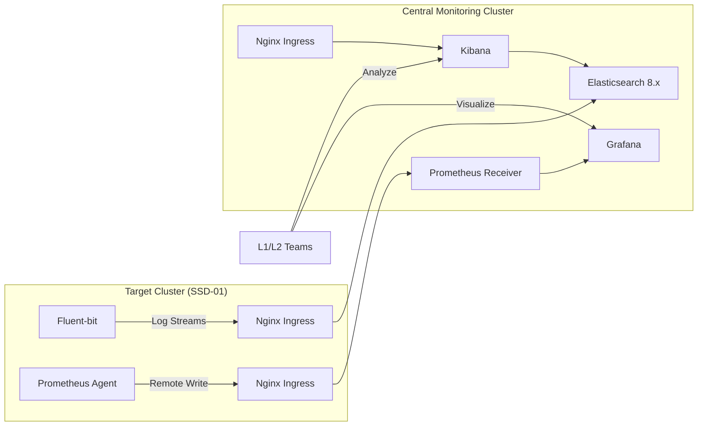

# Master Guide: Multi-Cluster Monitoring & Logging (SSD Environment)

This document provides the complete, low-level technical guide for setting up and managing a centralized monitoring and logging infrastructure across multiple Kubernetes clusters.

---

## 🏗️ 1. System Architecture

The following diagram illustrates the flow of metrics and logs from distributed agents to the central monitoring cluster.



---

## 🛠️ 2. Monitoring Cluster Configuration (Receivers)

### A. External Access (Nginx Ingress)
Three primary Ingress resources must be created in the `logging` or `monitoring` namespaces to allow remote clusters to push data.

**Elasticsearch External Ingress (`elasticsearch-external.yaml`):**
```yaml
apiVersion: networking.k8s.io/v1
kind: Ingress
metadata:
  name: elasticsearch-external
  namespace: logging
  annotations:
    nginx.ingress.kubernetes.io/backend-protocol: "HTTPS"
    nginx.ingress.kubernetes.io/proxy-ssl-verify: "off"
spec:
  ingressClassName: nginx
  rules:
  - host: elasticsearch.monitoring.opsmx.org
    http:
      paths:
      - path: /
        pathType: Prefix
        backend:
          service:
            name: elasticsearch-master
            port:
              number: 9200
```

### B. Kibana Security Hardening (Alerting)
Kibana 8.x requires encryption keys for Alerting. Apply these via `kubectl set env`:

```bash
kubectl --kubeconfig central-efk.config set env deployment/kibana-kibana -n logging \
  XPACK_ENCRYPTEDSAVEDOBJECTS_ENCRYPTIONKEY=ur+yOi7hZ0cpYo+j1ExeUQEL8izUGxfe \
  XPACK_REPORTING_ENCRYPTIONKEY=ur+yOi7hZ0cpYo+j1ExeUQEL8izUGxfe \
  XPACK_SECURITY_ENCRYPTIONKEY=ur+yOi7hZ0cpYo+j1ExeUQEL8izUGxfe
```

---

## 🚀 3. Target Cluster Configuration (Senders)

### A. Metrics (Prometheus Agent)
Install the Prometheus chart in `agentMode` to minimize resource usage on target clusters.

**Configuration (`monitoring-values.yaml`):**
```yaml
prometheus:
  agentMode: true
  remoteWrite:
    - url: "https://prometheus.monitoring.opsmx.org/api/v1/write"
      external_labels:
        cluster: "target-cluster-01"
```

### B. Logs (Fluent-bit Optimization)
Perform a clean installation using a values file that handles Elasticsearch 8 compatibility.

**Values (`fluent-bit-values-target.yaml`):**
```yaml
config:
  filters: |
    [FILTER]
        Name          modify
        Match         *
        Add           cluster target-cluster-01
  outputs: |
    [OUTPUT]
        Name            es
        Match           *
        Host            elasticsearch.monitoring.opsmx.org
        Port            443
        TLS             On
        TLS.Verify      Off
        HTTP_User       elastic
        HTTP_Passwd     <ELASTIC_PASSWORD>
        Logstash_Format On
        Logstash_Prefix target-01-logs
        Suppress_Type_Name On # Required for ES 8 compatibility
```

**Deployment:**
```bash
helm upgrade --install fluent-bit fluent/fluent-bit -n logging -f fluent-bit-values-target.yaml
```

---

## 📊 4. Operationalization

### Kibana Data View Setup
1. Navigate to **Stack Management > Data Views**.
2. Click **Create data view**.
3. **Index pattern**: `target-01-logs-*`.
4. **Timestamp field**: `@timestamp`.

### SSD Alerting (Kibana)
1. **Connector**: Go to **Connectors** and add an Email/Slack destination.
2. **Rule**: Create an **Elasticsearch Query** rule.
3. **Condition**: `When count is > 50 for the last 5 minutes` where `level : "error"`.

---

## 🩺 5. Troubleshooting Atlas

| Symptom | Error Message | Root Cause | Resolution |
| :--- | :--- | :--- | :--- |
| **CrashLoop** | `502 Bad Gateway` | Protocol mismatch | Set `backend-protocol: HTTPS` in Ingress. |
| **Auth Fail** | `401 Unauthorized` | Bad Credentials | Refresh password from Monitoring Cluster secret. |
| **Write Fail** | `Unknown parameter _type` | ES 8 Compatibility | Add `Suppress_Type_Name On` to Output. |
| **Alerts Blocked**| `Encryption key missing` | Security violation | Add `XPACK_*` vars to Kibana Deployment. |
| **No Logs** | `broken connection` | DNS or TLS failure | Verify external host resolution and `TLS On`. |
